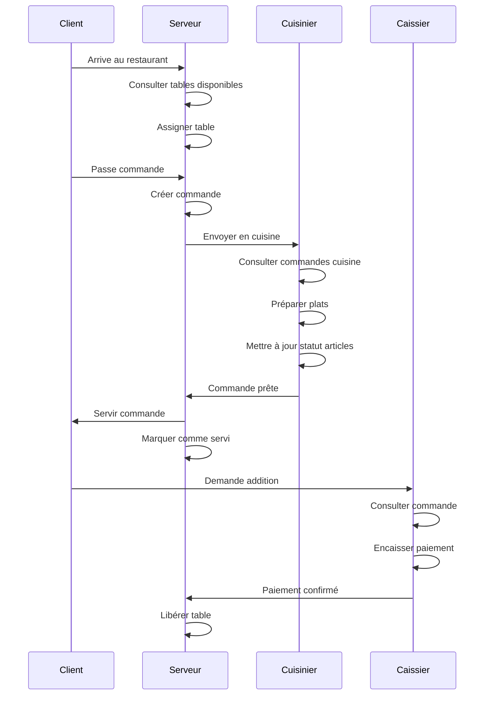
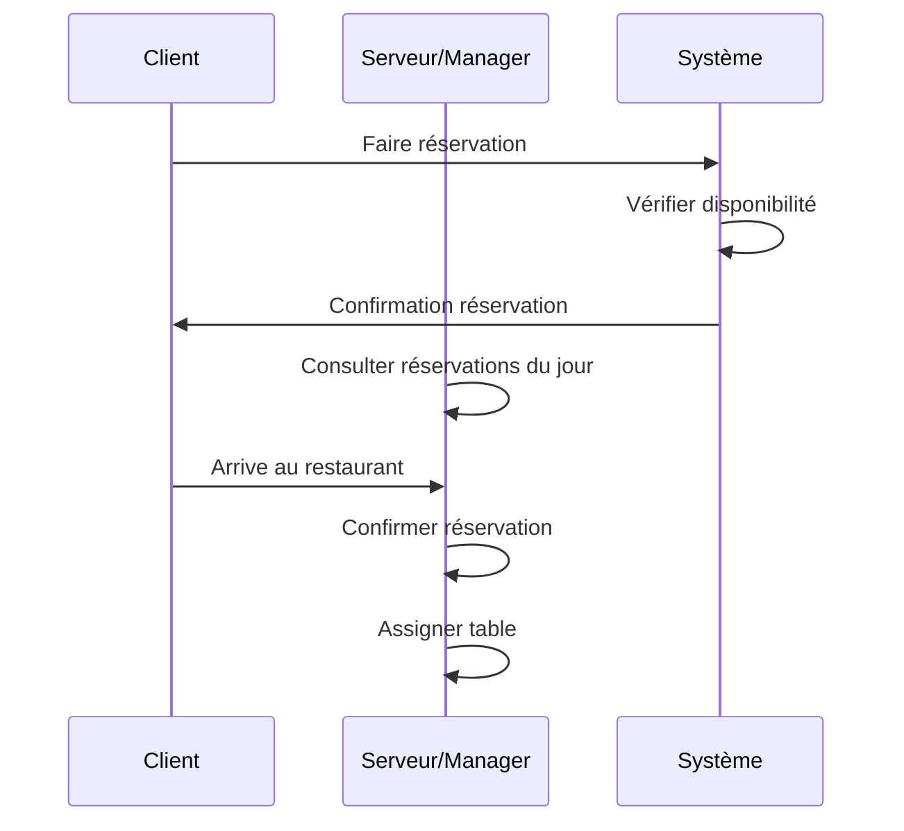
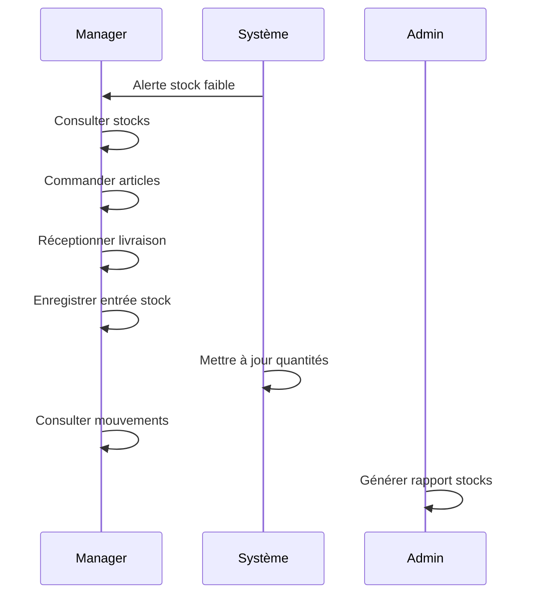

# Diagramme de Cas d'Utilisation - Chef's Table (Format Mermaid)

Ce diagramme peut être visualisé directement sur GitHub ou dans les éditeurs Markdown compatibles.

## Vue d'Ensemble des Acteurs et Fonctionnalités

```mermaid
graph TB
    subgraph Acteurs
        Admin[👤 Administrateur]
        Manager[👤 Gérant]
        Cashier[👤 Caissier]
        Waiter[👤 Serveur]
        Cook[👤 Cuisinier]
        Customer[👤 Client]
    end
    
    subgraph "Authentification"
        Login[Se connecter]
        Logout[Se déconnecter]
        ChangePass[Changer mot de passe]
        ManageUsers[Gérer utilisateurs]
        ManageRoles[Gérer rôles]
        ViewLogs[Consulter logs]
    end
    
    subgraph "Gestion Menu"
        ManageCategories[Gérer catégories]
        ManageMenuItems[Gérer plats]
        ToggleAvailability[Activer/Désactiver plat]
        ViewMenu[Consulter menu]
    end
    
    subgraph "Gestion Tables"
        ManageTables[Gérer tables]
        ViewAvailableTables[Tables disponibles]
        UpdateTableStatus[Mettre à jour statut table]
        ManageReservations[Gérer réservations]
        MakeReservation[Faire réservation]
    end
    
    subgraph "Gestion Commandes"
        CreateOrder[Créer commande]
        ViewOrders[Consulter commandes]
        UpdateOrderStatus[Mettre à jour statut]
        ViewKitchen[Vue cuisine]
        UpdateItemStatus[Mettre à jour article]
    end
    
    subgraph "Gestion Paiements"
        ProcessPayment[Encaisser paiement]
        ViewPayments[Consulter paiements]
        DailySummary[Résumé quotidien]
        RefundPayment[Rembourser]
    end
    
    subgraph "Gestion Stocks"
        ManageStock[Gérer articles stock]
        ViewLowStock[Alertes stock faible]
        AdjustStock[Ajuster quantité]
        ViewMovements[Mouvements stock]
    end
    
    subgraph "Rapports"
        ViewDashboard[Tableau de bord]
        GenerateReports[Générer rapports]
        ViewStats[Consulter statistiques]
    end
    
    subgraph "Paramètres"
        ManageSettings[Gérer paramètres]
        CreateBackup[Créer sauvegarde]
        RestoreBackup[Restaurer sauvegarde]
    end
    
    %% Relations Administrateur
    Admin --> Login
    Admin --> Logout
    Admin --> ChangePass
    Admin --> ManageUsers
    Admin --> ManageRoles
    Admin --> ViewLogs
    Admin --> ManageCategories
    Admin --> ManageMenuItems
    Admin --> ToggleAvailability
    Admin --> ManageTables
    Admin --> ViewAvailableTables
    Admin --> UpdateTableStatus
    Admin --> ManageReservations
    Admin --> CreateOrder
    Admin --> ViewOrders
    Admin --> UpdateOrderStatus
    Admin --> ProcessPayment
    Admin --> ViewPayments
    Admin --> DailySummary
    Admin --> RefundPayment
    Admin --> ManageStock
    Admin --> ViewLowStock
    Admin --> AdjustStock
    Admin --> ViewMovements
    Admin --> ViewDashboard
    Admin --> GenerateReports
    Admin --> ViewStats
    Admin --> ManageSettings
    Admin --> CreateBackup
    Admin --> RestoreBackup
    
    %% Relations Gérant
    Manager --> Login
    Manager --> Logout
    Manager --> ChangePass
    Manager --> ManageCategories
    Manager --> ManageMenuItems
    Manager --> ToggleAvailability
    Manager --> ManageTables
    Manager --> ViewAvailableTables
    Manager --> ManageReservations
    Manager --> ViewOrders
    Manager --> ViewPayments
    Manager --> DailySummary
    Manager --> ManageStock
    Manager --> ViewLowStock
    Manager --> ViewDashboard
    Manager --> GenerateReports
    Manager --> ViewStats
    
    %% Relations Caissier
    Cashier --> Login
    Cashier --> Logout
    Cashier --> ChangePass
    Cashier --> ViewOrders
    Cashier --> ProcessPayment
    Cashier --> ViewPayments
    Cashier --> DailySummary
    Cashier --> RefundPayment
    Cashier --> ViewDashboard
    
    %% Relations Serveur
    Waiter --> Login
    Waiter --> Logout
    Waiter --> ChangePass
    Waiter --> ViewMenu
    Waiter --> ViewAvailableTables
    Waiter --> UpdateTableStatus
    Waiter --> ManageReservations
    Waiter --> CreateOrder
    Waiter --> ViewOrders
    Waiter --> UpdateOrderStatus
    Waiter --> ViewDashboard
    
    %% Relations Cuisinier
    Cook --> Login
    Cook --> Logout
    Cook --> ChangePass
    Cook --> ViewKitchen
    Cook --> UpdateItemStatus
    Cook --> ViewDashboard
    
    %% Relations Client
    Customer --> ViewMenu
    Customer --> MakeReservation
    
    style Admin fill:#ff6b6b
    style Manager fill:#4ecdc4
    style Cashier fill:#45b7d1
    style Waiter fill:#96ceb4
    style Cook fill:#ffeaa7
    style Customer fill:#dfe6e9
```

## Matrice des Permissions par Rôle

| Fonctionnalité | Admin | Manager | Cashier | Waiter | Cook | Client |
|----------------|-------|---------|---------|--------|------|--------|
| **Authentification** |
| Se connecter | ✅ | ✅ | ✅ | ✅ | ✅ | ❌ |
| Gérer utilisateurs | ✅ | ❌ | ❌ | ❌ | ❌ | ❌ |
| Gérer rôles | ✅ | ❌ | ❌ | ❌ | ❌ | ❌ |
| Consulter logs | ✅ | ❌ | ❌ | ❌ | ❌ | ❌ |
| **Menu** |
| Gérer catégories | ✅ | ✅ | ❌ | ❌ | ❌ | ❌ |
| Gérer plats | ✅ | ✅ | ❌ | ❌ | ❌ | ❌ |
| Consulter menu | ✅ | ✅ | ✅ | ✅ | ✅ | ✅ |
| **Tables** |
| Gérer tables | ✅ | ✅ | ❌ | ❌ | ❌ | ❌ |
| Tables disponibles | ✅ | ✅ | ❌ | ✅ | ❌ | ❌ |
| Gérer réservations | ✅ | ✅ | ❌ | ✅ | ❌ | ❌ |
| Faire réservation | ❌ | ❌ | ❌ | ❌ | ❌ | ✅ |
| **Commandes** |
| Créer commande | ✅ | ✅ | ❌ | ✅ | ❌ | ❌ |
| Consulter commandes | ✅ | ✅ | ✅ | ✅ | ❌ | ❌ |
| Mettre à jour statut | ✅ | ✅ | ✅ | ✅ | ❌ | ❌ |
| Vue cuisine | ✅ | ❌ | ❌ | ❌ | ✅ | ❌ |
| **Paiements** |
| Encaisser | ✅ | ❌ | ✅ | ❌ | ❌ | ❌ |
| Consulter paiements | ✅ | ✅ | ✅ | ❌ | ❌ | ❌ |
| Rembourser | ✅ | ❌ | ✅ | ❌ | ❌ | ❌ |
| **Stocks** |
| Gérer stocks | ✅ | ✅ | ❌ | ❌ | ❌ | ❌ |
| Alertes stock | ✅ | ✅ | ❌ | ❌ | ❌ | ❌ |
| Ajuster quantité | ✅ | ✅ | ❌ | ❌ | ❌ | ❌ |
| **Rapports** |
| Tableau de bord | ✅ | ✅ | ✅ | ✅ | ✅ | ❌ |
| Générer rapports | ✅ | ✅ | ❌ | ❌ | ❌ | ❌ |
| **Paramètres** |
| Gérer paramètres | ✅ | ❌ | ❌ | ❌ | ❌ | ❌ |
| Sauvegardes | ✅ | ❌ | ❌ | ❌ | ❌ | ❌ |

## Flux de Travail Principaux

### 1. Flux de Commande (Service au Restaurant)

### 2. Flux de Réservation

### 3. Flux de Gestion des Stocks

## Cas d'Utilisation Détaillés

### UC-001 : Créer une Commande

**Acteur principal :** Serveur  
**Préconditions :** Serveur connecté, Table disponible  
**Scénario principal :**
1. Le serveur consulte les tables disponibles
2. Le serveur sélectionne une table
3. Le serveur consulte le menu
4. Le serveur ajoute des articles à la commande
5. Le serveur confirme la commande
6. Le système génère un numéro de commande
7. Le système envoie la commande en cuisine

**Scénario alternatif :**
- 2a. Aucune table disponible → Créer réservation
- 4a. Article non disponible → Suggérer alternative

### UC-002 : Encaisser un Paiement

**Acteur principal :** Caissier  
**Préconditions :** Commande servie  
**Scénario principal :**
1. Le caissier consulte la commande
2. Le caissier vérifie le montant total
3. Le caissier sélectionne la méthode de paiement
4. Le caissier encaisse le paiement
5. Le système génère un reçu
6. Le système marque la commande comme payée

**Scénario alternatif :**
- 4a. Paiement refusé → Proposer autre méthode
- 4b. Remise demandée → Appliquer remise (si autorisé)

### UC-003 : Gérer les Stocks

**Acteur principal :** Manager  
**Préconditions :** Manager connecté  
**Scénario principal :**
1. Le manager consulte les alertes de stock faible
2. Le manager sélectionne un article
3. Le manager ajuste la quantité
4. Le système enregistre le mouvement de stock
5. Le système met à jour les quantités

**Scénario alternatif :**
- 3a. Entrée de stock → Enregistrer réception
- 3b. Sortie de stock → Enregistrer utilisation
- 3c. Perte → Enregistrer comme waste

## Visualisation

Ce diagramme Mermaid peut être visualisé :
- Sur GitHub (affichage automatique)
- Dans VS Code avec l'extension "Markdown Preview Mermaid Support"
- Sur https://mermaid.live/
- Dans Notion, Obsidian, et autres éditeurs Markdown modernes
