# Diagramme de Classes - Chef's Table (Format Mermaid)

Ce diagramme peut être visualisé directement sur GitHub ou dans les éditeurs Markdown compatibles.

```mermaid
classDiagram
    %% ============================================
    %% CLASSES PRINCIPALES
    %% ============================================
    
    class User {
        -bigint id
        -string username
        -string first_name
        -string last_name
        -string email
        -string password
        -string phone
        -string avatar
        -boolean is_active
        -datetime last_login_at
        +hasRole(roleCode) boolean
        +hasAnyRole(roleCodes) boolean
        +getFullNameAttribute() string
        +scopeActive()
        +scopeRole(roleCode)
    }
    
    class Role {
        -int id
        -string name
        -string code
        -string description
        +scopeByCode(code)
    }
    
    class Category {
        -int id
        -string name
        -text description
        -string image
        -int sort_order
        -boolean is_active
        +scopeActive()
        +scopeOrdered()
    }
    
    class MenuItem {
        -bigint id
        -int category_id
        -string name
        -text description
        -decimal price
        -string image
        -int preparation_time
        -boolean is_available
        -boolean is_featured
        -string allergens
        -int calories
        +scopeAvailable()
        +scopeFeatured()
        +getFormattedPriceAttribute() string
    }
    
    class RestaurantTable {
        -bigint id
        -string number
        -int capacity
        -string location
        -string status
        -text notes
        +currentOrder()
        +scopeAvailable()
        +isAvailable() boolean
    }
    
    class Order {
        -bigint id
        -string order_number
        -bigint table_id
        -bigint waiter_id
        -string status
        -string order_type
        -decimal subtotal
        -decimal tax_amount
        -decimal discount_amount
        -decimal total_amount
        -text notes
        -int guests_count
        +calculateTotals()
        +scopeByStatus(status)
        +scopeForKitchen()
        +scopeForCashier()
        +isPaid() boolean
        +getFormattedTotalAttribute() string
    }
    
    class OrderItem {
        -bigint id
        -bigint order_id
        -bigint menu_item_id
        -int quantity
        -decimal unit_price
        -text notes
        -string status
        +getTotalAttribute() float
        +getFormattedTotalAttribute() string
        +scopeByStatus(status)
    }
    
    class Payment {
        -bigint id
        -string payment_number
        -bigint order_id
        -bigint cashier_id
        -decimal amount
        -string payment_method
        -string status
        -string transaction_reference
        -text notes
        +scopeByStatus(status)
        +scopeCompleted()
        +scopeToday()
        +getFormattedAmountAttribute() string
        +getMethodLabelAttribute() string
    }
    
    class Reservation {
        -bigint id
        -bigint table_id
        -string customer_name
        -string customer_phone
        -string customer_email
        -int guests_count
        -date reservation_date
        -string reservation_time
        -int duration
        -string status
        -text notes
        +scopeToday()
        +scopeUpcoming()
        +scopeByStatus(status)
        +canBeCancelled() boolean
        +getStatusLabelAttribute() string
        +getFormattedDateTimeAttribute() string
    }
    
    class StockItem {
        -bigint id
        -string name
        -text description
        -string category
        -decimal quantity
        -string unit
        -decimal min_quantity
        -decimal unit_cost
        -string supplier
        -datetime expiry_date
        +isLowStock() boolean
        +scopeLowStock()
        +scopeExpiringSoon()
        +scopeByCategory(category)
        +getTotalValueAttribute() float
    }
    
    class StockMovement {
        -bigint id
        -bigint stock_item_id
        -string type
        -decimal quantity
        -decimal quantity_before
        -decimal quantity_after
        -bigint user_id
        -string reason
        -string reference
        +scopeByType(type)
        +getTypeLabelAttribute() string
    }
    
    class Setting {
        -bigint id
        -string key
        -string value
        -string type
        -string group
        -text description
        +getValue(key, default) any
        +setValue(key, value, type, group) Setting
        +getCastedValue() any
        +scopeByGroup(group)
        +getAllAsArray() array
    }
    
    class Backup {
        -bigint id
        -string filename
        -string path
        -bigint size
        -string type
        -string status
        -bigint created_by
        -text notes
        +scopeCompleted()
        +getFormattedSizeAttribute() string
        +getTypeLabelAttribute() string
        +getStatusLabelAttribute() string
    }
    
    class ActivityLog {
        -bigint id
        -bigint user_id
        -string action
        -string model_type
        -bigint model_id
        -json old_values
        -json new_values
        -string ip_address
        -string user_agent
        +log(action, modelType, modelId, oldValues, newValues) ActivityLog
        +scopeByUser(userId)
        +scopeByAction(action)
        +scopeForModel(type, id)
        +getActionLabelAttribute() string
    }
    
    %% ============================================
    %% RELATIONS
    %% ============================================
    
    User "0..*" -- "0..*" Role : belongs to many
    User "1" -- "0..*" Order : creates (waiter_id)
    User "1" -- "0..*" Payment : processes (cashier_id)
    User "1" -- "0..*" StockMovement : registers
    User "1" -- "0..*" ActivityLog : performs
    User "1" -- "0..*" Backup : creates
    
    Category "1" -- "0..*" MenuItem : contains
    
    MenuItem "1" -- "0..*" OrderItem : referenced in
    
    RestaurantTable "1" -- "0..*" Order : has
    RestaurantTable "1" -- "0..*" Reservation : reserved for
    
    Order "1" -- "0..*" OrderItem : contains
    Order "1" -- "0..1" Payment : paid by
    
    StockItem "1" -- "0..*" StockMovement : has movements
```

## Notes

### Rôles Utilisateurs
- **admin** : Administrateur
- **manager** : Gérant
- **cashier** : Caissier
- **waiter** : Serveur
- **cook** : Cuisinier

### Statuts des Commandes
- **pending** : En attente
- **preparing** : En préparation
- **ready** : Prêt
- **served** : Servi
- **paid** : Payé
- **completed** : Terminé
- **cancelled** : Annulé

### Méthodes de Paiement
- **cash** : Espèces
- **card** : Carte bancaire
- **mobile** : Paiement mobile
- **other** : Autre

### Types de Mouvements de Stock
- **in** : Entrée
- **out** : Sortie
- **adjustment** : Ajustement
- **waste** : Perte

## Visualisation

Ce diagramme Mermaid peut être visualisé :
- Sur GitHub (affichage automatique)
- Dans VS Code avec l'extension "Markdown Preview Mermaid Support"
- Sur https://mermaid.live/
- Dans Notion, Obsidian, et autres éditeurs Markdown modernes
